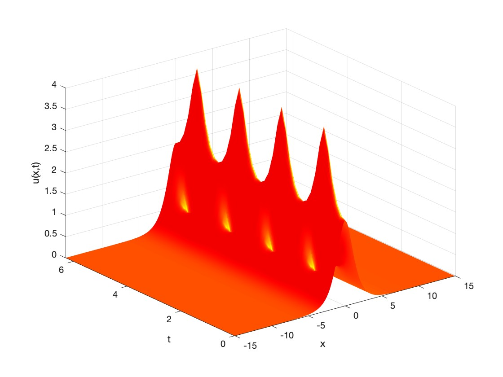
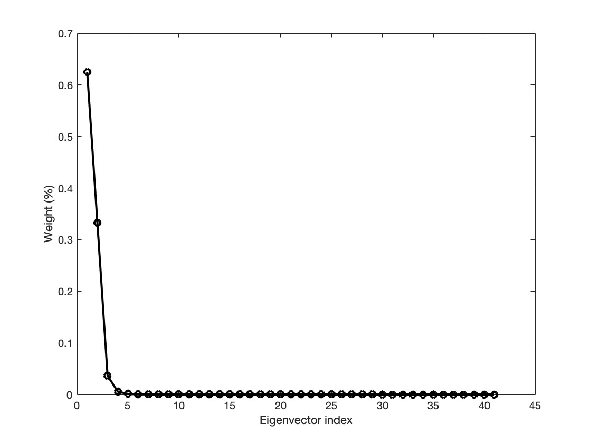

Reduced Order Model for non-linear Schrödinger Equation
================
Mohamad Nabizadeh
3/7/2022

-   [Problem definition](#problem-definition)
-   [Numerical solution](#numerical-solution)
    -   [Results](#results)
-   [Reduced order modeling](#reduced-order-modeling)
    -   [First-order model](#first-order-model)
    -   [Third-order model](#third-order-model)
        -   [Implementation](#implementation)
        -   [Results](#results-1)

# Problem definition

The objective of this report is to present a numerical solution for the
non-linear Schrödinger equation and to showcase the applicability of
reduced order model on such computationally exhaustive problems.
Schrödinger equation can be written as follows:

Where *u* is the physical state of the system, *u**t* is the
time derivative, *u**x**x* is the second spatial derivative,
and \|*u*\| is a scalar representing the absolute size of *u*. To solve
this ODE, first, let’s keep *u**t* on the left hand side of
the equation and take all the other terms to the right hand side, and
multiply both sides by  − *i*, we get:

# Numerical solution

We can now use Fourier basis algorithm to computationally solve this
equation, taking Fourier transform of both sides gives the following:

Now we can use this first order ODE, and solve it in a time-stepper
loop. A sample code is imlemented in Matlab.

where the **nls\_rhs** is defined as:

## Results

1.  Surface plot of the numeric solution, b. weights of different modes
    in percentage, and c. Top three modes.

# Reduced order modeling

## First-order model

Despite the high dimensional nature of the problem, we see -both
visually and quantitatively- that 3 orthogonal components can explain
more than 99% of the standard deviation in the answer. Therefore, we’re
planning to use only those components to build the solution. First,
let’s consider only one component. Let’s use separation of variables:

where,

there is only one mode, and we know that the inner product of each
component by itself is:

Plug that in:

Therefore, in the case of reducing the order to 1, we get to the
following ODE:

which in fact has the following analytical solution.

But, we know that existence of an analytical solution is highly unlikely
for higher orders and we’ll need numerical techniques to aquire a
solution.

## Third-order model

Let’s use the first three orthogonal components now, rewrite the ODE
first:

From seperation of variables, we have:

Also, we have from eigenvalue decomposition the following:

where,

Let’s plug that into our ODE:

Which is our approximation of the solution for this 2D system. Apart
from the equation, we also need initial conditions, where
*s**e**c**h*(*x*) is proposed as an appropriate initial condition for
*u*(*x*, 0). Therefore:

Having established the reduced order model, and the initial conditions,
we can now proceed to the implementation of the model, but before that,
let’s quickly remind about how we calculate a second derivative by the
means of Fourier transform.

Let’s now take a look at our implementation in Matlab:

### Implementation

where,

### Results

We can see that using the top three vectors, we can build a model that
can reproduce a solution that closely resembles that of the original
problem. This is a great example on how reduced order modeling can
provide much more efficient solutions with minor loss of information.

A special shout-out to [Nathan
Kutz](https://www.youtube.com/channel/UCoUOaSVYkTV6W4uLvxvgiFA) for his
great content on the subject.
